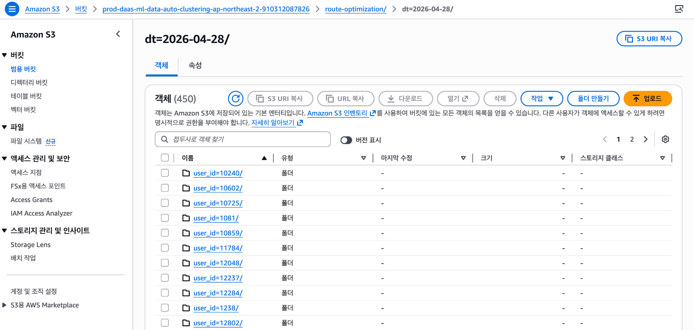
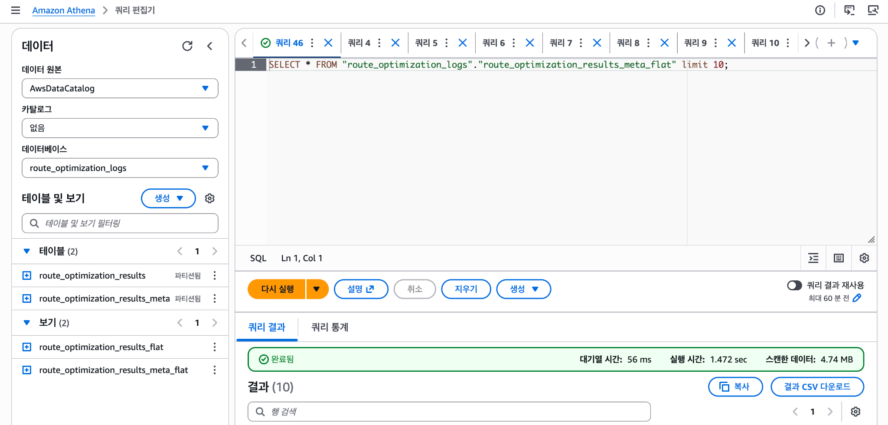
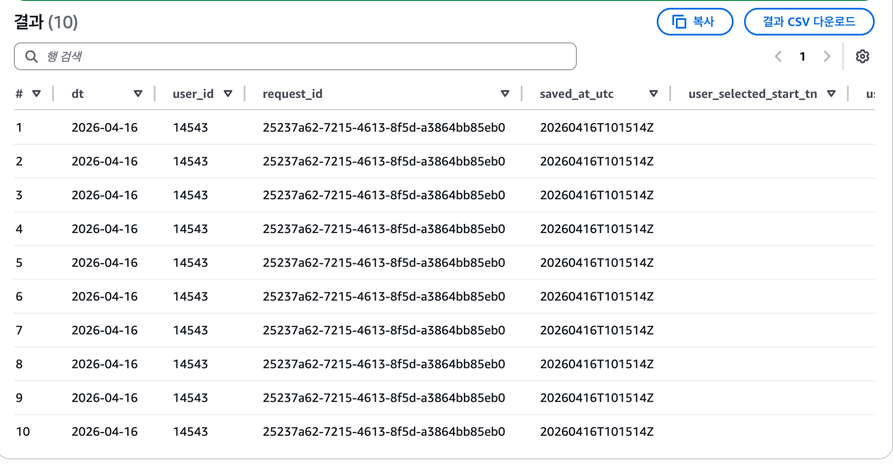

# Delivery Route Optimization Lambda

> Korean version: [README_Kver.md](./README_Kver.md)

> **Real-time delivery route optimization API built on AWS Lambda**  
> This serverless project retrieves a driver's remaining deliveries for the day and automatically generates an optimized visit sequence by combining road-network-based cost matrices from OSRM with an ALNS optimization algorithm.

---

## Preview

### Route Optimization Result

<!--
<p align="center">
  
</p>

<p align="center">
  <a href="./lambda/docs/demo_tiny.mp4">▶ Watch compressed demo video</a>
</p>
-->

<p align="center">
  
</p>

---

## 1. Project Overview

This project is an AWS Lambda-based route optimization API designed to automatically calculate the optimal visit sequence for each last-mile delivery driver.

In the previous workflow, drivers had to manually review address lists and determine the delivery order based on personal experience. This made delivery efficiency highly dependent on driver skill and created a higher cognitive load for new or less experienced drivers.

This system connects company delivery data, departure location data, OSRM distance matrices, and ALNS optimization logic to provide an optimized delivery sequence by `user_id` through an API.

---

## 2. Business Problem

The delivery operation had several challenges:

- Delivery order depended heavily on individual driver experience.
- Inefficient routes caused unnecessary travel distance and time.
- New or less experienced drivers had difficulty deciding the best route.
- The operations team needed a standardized way to evaluate whether recommended routes were used.
- The ETA system required standardized visit-order data that could be reused downstream.

---

## 3. Solution

The system retrieves a driver's remaining deliveries for the day, calculates road-network-based travel costs, and applies an optimization algorithm to generate the recommended visit sequence.

```text
Driver ID input
      ↓
Load today's undelivered items
      ↓
Build departure point + delivery coordinates
      ↓
Generate OSRM distance/time matrix
      ↓
Run ALNS optimization
      ↓
Generate optimized visit sequence
      ↓
Save result to S3 and return API response
```

---

## 4. Core Features

### 4.1 Driver-Level Delivery Data Retrieval

The API retrieves the undelivered items assigned to a specific driver using `user_id`.

The loaded data includes:

- Tracking number
- Road address
- Detailed address
- Latitude / longitude
- Area and sector information
- Departure location coordinates

Database credentials are not hardcoded in the source code. They are managed through AWS SSM Parameter Store.

---

### 4.2 OSRM-Based Distance Matrix Generation

The system calls the OSRM Table API using delivery coordinates and departure location coordinates to generate distance and duration matrices between all points.

```text
Departure point + delivery points
      ↓
OSRM Table API call
      ↓
N x N distance/time matrix
      ↓
Input for ALNS optimization
```

Because the system uses road-network-based travel costs rather than straight-line distance, the generated route is much closer to real operational conditions.

---

### 4.3 ALNS-Based Visit Sequence Optimization

The optimization engine runs ALNS (Adaptive Large Neighborhood Search) based on the OSRM distance matrix.

Key logic includes:

- Setting the departure point as the start node
- Fixing a user-selected tracking number as the start point when provided
- Fixing a user-selected tracking number as the end point when provided
- Dynamically adjusting search iterations based on the number of delivery points
- Post-processing deliveries with the same address or identical coordinates
- Reusing cached optimization results when available

---

### 4.4 Fixed Start / End Point Option

The API supports operational cases where a specific delivery item must be fixed as the first or last stop.

```json
{
  "user_id": 26854,
  "user_selected_start_tn": "1234567890",
  "user_selected_end_tn": "9876543210"
}
```

If both fields are empty, the route is optimized automatically from the departure point.

---

### 4.5 S3 Result Storage and Athena Analysis

Route optimization results are saved to S3 separately from the API response.

```text
s3://{bucket}/{prefix}/dt=YYYY-MM-DD/user_id={user_id}/request_id={request_id}.json
```

The partition structure was designed around `dt`, `user_id`, and `request_id` to support Athena queries.

Example use cases:

- Analyze whether drivers follow recommended routes
- Compare actual delivery sequence with recommended sequence
- Monitor route optimization API usage
- Automate operational reporting
- Provide input data for ETA calculation systems

#### Actual S3 Partition Structure

Lambda execution results are partitioned by `dt` and `user_id` in S3. This makes it possible to trace optimization results by date, driver, and individual request while also connecting naturally to Athena external tables.

<p align="center">
  
</p>

```text
route-optimization/
└── dt=YYYY-MM-DD/
    └── user_id={user_id}/
        └── request_id={request_id}.json
```

#### Athena Table and Flattened View

The JSON results stored in S3 are connected to an Athena external table. For easier analysis, a flattened view was created.

Because the original JSON includes nested structures such as `meta`, `input`, and `result.df_ordered`, the Athena view uses `CROSS JOIN UNNEST` to flatten the result into delivery-level rows.

<p align="center">
  
</p>

Example query:

```sql
SELECT *
FROM "route_optimization_logs"."route_optimization_results_meta_flat"
LIMIT 10;
```

The query result exposes metadata such as `dt`, `user_id`, `request_id`, `saved_at_utc`, selected start/end tracking numbers, and optimized delivery rows.

<p align="center">
  
</p>

This structure enables the operations team to extend analysis into:

- Daily route optimization API call counts
- Driver-level optimization history
- S3 raw JSON tracing by `request_id`
- Comparison between recommended sequence and actual completed sequence
- Validation of data passed to ETA calculation Lambda

---

### 4.6 ETA Lambda Integration

After route optimization is completed, the system can asynchronously invoke the ETA calculation Lambda.

```text
Route Optimization Lambda
      ↓
Save result to S3
      ↓
Asynchronously invoke ETA Calculate Lambda
      ↓
Update ETA based on DynamoDB
```

To avoid increasing API response latency, the Lambda-to-Lambda call uses asynchronous invocation with `InvocationType="Event"`.

---

## 5. Architecture

```text
Flex App / TMS
      ↓
Lambda Function URL or API Gateway
      ↓
Route Optimization Lambda
      ↓
MySQL delivery data query
      ↓
OSRM Table API
      ↓
ALNS Optimization
      ↓
JSON Response
      ↓
S3 Result Save
      ↓
Athena Analysis / ETA Lambda
```

---

## 6. API Specification

### Endpoint

```http
POST /route-opt
```

### Request Body

| Field | Type | Required | Description |
| --- | --- | --- | --- |
| `user_id` | integer | Y | Delivery driver user ID |
| `user_selected_start_tn` | string / null | N | Tracking number to fix as the starting point |
| `user_selected_end_tn` | string / null | N | Tracking number to fix as the ending point |

### Example Request

```json
{
  "user_id": 26854,
  "user_selected_start_tn": null,
  "user_selected_end_tn": null
}
```

### Example Response

```json
{
  "success": true,
  "meta": {
    "status": "OK",
    "reason_code": "OPTIMIZED_ROUTE",
    "cache": {
      "hit": false
    },
    "s3": {
      "saved": true
    }
  },
  "result": {
    "df_ordered": {
      "columns": [
        "id",
        "Area",
        "tracking_number",
        "address_road",
        "address2",
        "lat",
        "lng",
        "ordering",
        "sub_order"
      ],
      "data": []
    }
  }
}
```

---

## 7. Error Handling

| Error Code | Description |
| --- | --- |
| `MISSING_BODY` | Request body is missing |
| `INVALID_JSON_BODY` | Request body is not valid JSON |
| `MISSING_USER_ID` | `user_id` is missing |
| `INVALID_USER_ID` | `user_id` has an invalid type |
| `INVALID_SAME_START_END` | Start and end tracking numbers are the same |
| `NO_SHIPPING_DATA` | No delivery data found for the driver |
| `START_TN_NOT_FOUND` | Selected start tracking number was not found in the delivery list |
| `END_TN_NOT_FOUND` | Selected end tracking number was not found in the delivery list |
| `MERGE_EMPTY` | Failed to merge delivery data and departure point data |
| `INVALID_COORDINATES` | Invalid coordinate values detected |
| `SWAPPED_COORDINATES_DETECTED` | Latitude and longitude appear to be swapped |
| `INTERNAL_SERVER_ERROR` | Internal server error |

---

## 8. Tech Stack

| Category | Stack |
| --- | --- |
| Runtime | Python |
| Infrastructure | AWS Lambda, AWS SAM, CloudFormation |
| Packaging | Docker, Amazon ECR |
| Database | MySQL |
| Storage | Amazon S3 |
| Analysis | Amazon Athena |
| Routing Engine | OSRM |
| Optimization | ALNS |
| Data Processing | Pandas, NumPy |
| Monitoring | CloudWatch Logs |
| Secrets / Config | AWS SSM Parameter Store |

---

## 9. Project Structure

```text
.
├── app.py
├── Dockerfile
├── template.yaml
├── requirements.txt
├── queries/
│   ├── item.py
│   └── unit.py
├── utils/
│   ├── db_handler.py
│   └── preprocess/
│       └── transform_matix.py
├── alns_later_supernode/
│   ├── api.py
│   ├── solver.py
│   ├── operators.py
│   ├── postprocess.py
│   ├── cache.py
│   └── payload.py
├── docs/
│   ├── demo_preview.gif
│   ├── demo_small.mp4
│   └── images/
│       ├── app_route.png
│       ├── s3_partition_structure.png
│       ├── athena_query_editor.png
│       └── athena_query_result.png
└── events/
    └── example_route_opt.json
```

---

## 10. What I Did

### System Design

- Designed a route optimization API based on AWS Lambda
- Built a deployment structure using Lambda Container Image
- Designed the S3 result storage structure and Athena query workflow
- Designed asynchronous integration with the ETA calculation Lambda

### Optimization Logic

- Generated distance/time matrices using the OSRM Table API
- Applied ALNS-based visit sequence optimization
- Implemented optional fixed start and fixed end delivery points
- Added post-processing for deliveries with the same address or identical coordinates
- Added result caching to reduce repeated optimization work

### Operation

- Tracked issues through CloudWatch Logs
- Handled OSRM timeout and connection errors
- Improved response time by optimizing caching and data processing flow
- Built a data structure to validate recommended routes using operational data

---

## 11. Performance & Impact

This system was designed to support the following operational improvements:

- Automate driver-level delivery sequence planning
- Reduce routing burden for new or less experienced drivers
- Standardize recommended delivery sequences across operations
- Enable post-analysis using S3 and Athena
- Provide reusable visit-order data for ETA systems

During optimization and operational testing, the API response time was improved as follows:

| Metric | Before | After | Effect |
| --- | ---: | ---: | ---: |
| Average Response Time | 15.55 sec | 5.38 sec | 65% faster |

---

## Key Takeaway

> This project transformed route planning from a driver-experience-dependent process into a standardized, API-driven optimization system.  
> By combining OSRM, ALNS, AWS Lambda, S3, Athena, and asynchronous ETA integration, it provides production-ready route sequence data for last-mile delivery operations.
