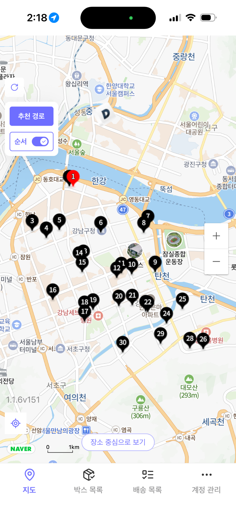

# Delivery Route Optimization Lambda

> **AWS Lambda 기반 실시간 배송 경로 최적화 API**  
> 배송기사의 당일 미배송 물량을 조회하고, 실제 도로망 기반 거리행렬(OSRM)과 ALNS 최적화 알고리즘을 결합하여 최적 방문 순서를 자동 산출하는 서버리스 프로젝트입니다.

---

## Preview

### Mobile App Result

<p align="center">
  
</p>

### Demo Video

GitHub README에서는 `<video>` 태그가 안정적으로 재생되지 않기 때문에, 아래 썸네일을 클릭해 영상을 확인하는 방식으로 구성했습니다.

<p align="center">
  <a href="./lambda/docs/demo.mp4">
    
  </a>
</p>

<p align="center">
  <a href="./lambda/docs/demo.mp4">▶ Watch Demo Video</a>
</p>

---

## 1. Project Overview

이 프로젝트는 라스트마일 배송 운영에서 **배송기사별 최적 방문 순서**를 자동으로 산출하기 위해 구축한 AWS Lambda 기반 경로 최적화 API입니다.

기존 운영에서는 배송기사가 주소 목록을 직접 확인하고 경험적으로 배송 순서를 판단해야 했습니다. 이 방식은 기사 숙련도에 따라 배송 효율이 달라지고, 신규 기사에게는 동선 판단의 부담이 커지는 문제가 있었습니다.

본 시스템은 회사 DB의 배송 아이템, 출차지 정보, OSRM 거리행렬, ALNS 최적화 로직을 연결하여 `user_id` 기준의 최적 배송 순서를 API 형태로 제공합니다.

---

## 2. Problem

배송 운영 과정에서 다음과 같은 문제가 있었습니다.

- 배송 순서가 기사 경험에 크게 의존함
- 비효율적인 이동 동선이 발생함
- 신규 기사 또는 미숙련 기사에게 동선 판단 부담이 큼
- 운영팀이 추천 경로 사용 여부를 데이터로 검증하기 어려움
- ETA 시스템과 연동 가능한 표준화된 방문 순서 데이터가 필요함

---

## 3. Solution

본 프로젝트는 배송기사의 당일 배송 물량을 조회한 뒤, 실제 도로망 기반 이동 비용을 계산하고 최적화 알고리즘을 적용하여 방문 순서를 산출합니다.

```text
배송기사 ID 입력
      ↓
당일 미배송 물량 조회
      ↓
출차지 + 배송지 좌표 구성
      ↓
OSRM 거리행렬 생성
      ↓
ALNS 최적화
      ↓
방문 순서 산출
      ↓
S3 저장 및 API 응답
```

---

## 4. Core Features

### 4.1 기사별 당일 배송 물량 조회

`user_id`를 기준으로 해당 기사에게 할당된 당일 미배송 배송건을 조회합니다.

조회 데이터에는 다음 정보가 포함됩니다.

- 송장번호
- 배송지 도로명주소
- 상세주소
- 위도 / 경도
- 권역 및 섹터 정보
- 출차지 좌표

DB 접속 정보는 코드에 직접 저장하지 않고 AWS SSM Parameter Store를 통해 관리합니다.

---

### 4.2 OSRM 기반 거리행렬 생성

배송지와 출차지 좌표를 기반으로 OSRM Table API를 호출하여 지점 간 이동거리 및 이동시간 행렬을 생성합니다.

```text
출차지 + 배송지 목록
      ↓
OSRM Table API 호출
      ↓
N x N 거리행렬 생성
      ↓
ALNS 최적화 입력값으로 변환
```

단순 직선거리가 아니라 실제 도로망 기반 이동 비용을 사용하기 때문에, 운영 환경에 더 가까운 경로 최적화가 가능합니다.

---

### 4.3 ALNS 기반 방문 순서 최적화

OSRM 거리행렬을 기반으로 ALNS(Adaptive Large Neighborhood Search) 알고리즘을 수행합니다.

적용 로직은 다음과 같습니다.

- 출차지를 시작 노드로 설정
- 사용자가 지정한 시작 송장번호를 시작점으로 고정
- 사용자가 지정한 종료 송장번호를 종료점으로 고정
- 배송지 수에 따라 탐색 반복 횟수 조정
- 동일 주소 또는 동일 좌표 배송건 후처리
- 캐시가 존재하는 경우 기존 최적화 결과 재사용

---

### 4.4 시작 / 종료 지점 고정 기능

운영 상황에 따라 특정 배송건을 시작점 또는 종료점으로 고정할 수 있습니다.

```json
{
  "user_id": 26854,
  "user_selected_start_tn": "1234567890",
  "user_selected_end_tn": "9876543210"
}
```

두 값을 모두 비워두면 출차지를 기준으로 자동 최적화합니다.

---

### 4.5 S3 결과 저장 및 Athena 분석 연계

경로 최적화 결과는 API 응답과 별도로 S3에 저장됩니다.

```text
s3://{bucket}/{prefix}/dt=YYYY-MM-DD/user_id={user_id}/request_id={request_id}.json
```

이 구조는 Athena 조회를 고려하여 `dt`, `user_id`, `request_id` 기준으로 설계했습니다.

활용 예시는 다음과 같습니다.

- 기사별 추천 경로 사용 여부 분석
- 실제 배송 순서와 추천 순서 비교
- 경로 최적화 API 사용량 분석
- 운영 리포트 자동화
- ETA 계산 시스템의 입력 데이터로 활용

---

### 4.6 ETA Lambda 연동

경로 최적화가 완료되면 ETA 계산 Lambda를 비동기로 호출할 수 있습니다.

```text
Route Optimization Lambda
      ↓
S3 결과 저장
      ↓
ETA Calculate Lambda 비동기 호출
      ↓
DynamoDB 기준 ETA 갱신
```

API 응답 지연을 막기 위해 `InvocationType="Event"` 방식의 비동기 호출 구조를 사용합니다.

---

## 5. Architecture

```text
Flex App / TMS
      ↓
Lambda Function URL or API Gateway
      ↓
Route Optimization Lambda
      ↓
MySQL 배송 데이터 조회
      ↓
OSRM Table API
      ↓
ALNS Optimization
      ↓
JSON Response
      ↓
S3 Result Save
      ↓
Athena Analysis / ETA Lambda
```

---

## 6. API Specification

### Endpoint

```http
POST /route-opt
```

### Request Body

| Field | Type | Required | Description |
| --- | --- | --- | --- |
| `user_id` | integer | Y | 배송기사 사용자 ID |
| `user_selected_start_tn` | string/null | N | 시작 지점으로 고정할 송장번호 |
| `user_selected_end_tn` | string/null | N | 종료 지점으로 고정할 송장번호 |

### Example Request

```json
{
  "user_id": 26854,
  "user_selected_start_tn": null,
  "user_selected_end_tn": null
}
```

### Example Response

```json
{
  "success": true,
  "meta": {
    "status": "OK",
    "reason_code": "OPTIMIZED_ROUTE",
    "cache": {
      "hit": false
    },
    "s3": {
      "saved": true
    }
  },
  "result": {
    "df_ordered": {
      "columns": [
        "id",
        "Area",
        "tracking_number",
        "address_road",
        "address2",
        "lat",
        "lng",
        "ordering",
        "sub_order"
      ],
      "data": []
    }
  }
}
```

---

## 7. Error Handling

| Error Code | Description |
| --- | --- |
| `MISSING_BODY` | 요청 body 누락 |
| `INVALID_JSON_BODY` | JSON 형식 오류 |
| `MISSING_USER_ID` | `user_id` 누락 |
| `INVALID_USER_ID` | `user_id` 타입 오류 |
| `INVALID_SAME_START_END` | 시작/종료 송장번호가 동일함 |
| `NO_SHIPPING_DATA` | 해당 기사에게 조회되는 배송 데이터 없음 |
| `START_TN_NOT_FOUND` | 시작 송장번호가 배송 목록에 없음 |
| `END_TN_NOT_FOUND` | 종료 송장번호가 배송 목록에 없음 |
| `MERGE_EMPTY` | 배송 데이터와 출차지 데이터 병합 실패 |
| `INVALID_COORDINATES` | 좌표값 비정상 |
| `SWAPPED_COORDINATES_DETECTED` | 위도/경도 뒤집힘 의심 |
| `INTERNAL_SERVER_ERROR` | 서버 내부 오류 |

---

## 8. Tech Stack

| Category | Stack |
| --- | --- |
| Runtime | Python |
| Infra | AWS Lambda, AWS SAM, CloudFormation |
| Packaging | Docker, ECR |
| Database | MySQL |
| Storage | Amazon S3 |
| Analysis | Amazon Athena |
| Routing Engine | OSRM |
| Optimization | ALNS |
| Data Processing | Pandas, NumPy |
| Monitoring | CloudWatch Logs |

---

## 9. Project Structure

```text
.
├── app.py
├── Dockerfile
├── template.yaml
├── requirements.txt
├── queries/
│   ├── item.py
│   └── unit.py
├── utils/
│   ├── db_handler.py
│   └── preprocess/
│       └── transform_matix.py
├── alns_later_supernode/
│   ├── api.py
│   ├── solver.py
│   ├── operators.py
│   ├── postprocess.py
│   ├── cache.py
│   └── payload.py
├── docs/
│   ├── demo.mp4
│   └── images/
│       └── app_route.png
└── events/
    └── example_route_opt.json
```

---

## 10. What I Did

### System Design

- AWS Lambda 기반 경로 최적화 API 설계
- Lambda Container Image 기반 배포 구조 구성
- S3 저장 구조 및 Athena 조회 구조 설계
- ETA Lambda와 비동기 연동 구조 설계

### Optimization Logic

- OSRM Table API 기반 거리행렬 생성
- ALNS 기반 방문 순서 최적화 로직 적용
- 시작점 / 종료점 고정 옵션 반영
- 동일 주소 및 동일 좌표 배송건 후처리

### Operation

- CloudWatch 로그 기반 장애 추적
- OSRM timeout 및 connection error 대응
- Lambda cold start 및 응답속도 개선
- 운영 데이터 기반 추천 경로 검증 구조 구축

---

## 11. Performance & Impact

운영 환경에서 다음과 같은 개선을 목표로 설계했습니다.

- 기사별 배송 순서 자동화
- 신규 기사 동선 판단 부담 완화
- 추천 경로 기반 운영 표준화
- S3/Athena 기반 사후 분석 가능
- ETA 시스템과 연계 가능한 방문 순서 데이터 제공

기존 실험 및 운영 개선 과정에서 다음과 같은 성능 개선을 확인했습니다.

| Metric | Before | After |
| --- | --- | --- |
| Average Response Time | 15.55 sec | 5.38 sec |

추가 개선 효과:

- 클러스터링 처리 시간 약 38% 절감
- 평균 지점 간 이동거리 약 15% 개선
- SLA 개선 효과 약 3.4%